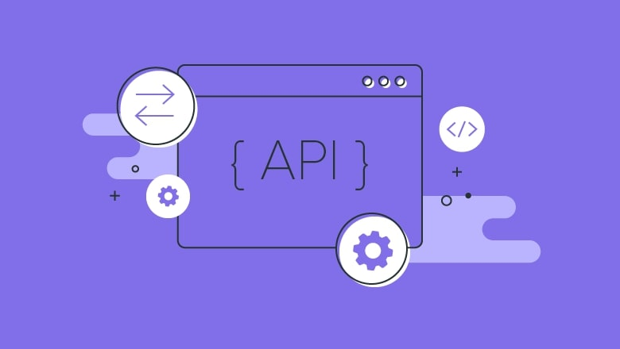

# PWP SPRING 2020
# PROJECT NAME

# Group information

* Student 1. Emil Dark, d4rkemil@gmail.com
* Student 2. Name, email
* Student 3. Name, email

***
__Remember to include all required documentation and HOWTOs, including how to create and populate the database, how to run and test the API, the url to the entrypoint and instructions on how to setup and run the client__

- [ ] Documentation
- [ ] URL entrypoint
- [ ] HOWTOs
    >- [ ] How to create the database
    >- [ ] How to populate the database
    >- [ ] How to RUN API
    >- [ ] How to test API
    >- [ ] How to setup client
    >- [ ] How to RUN client

***

